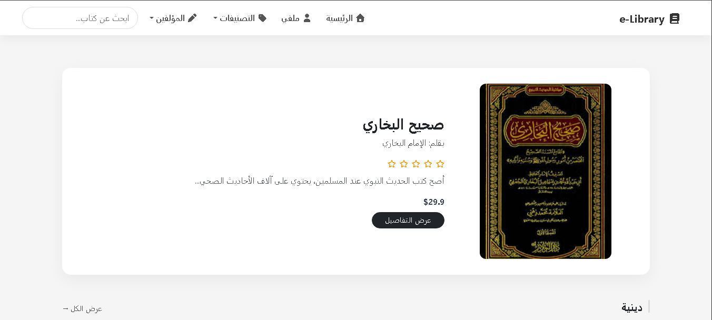
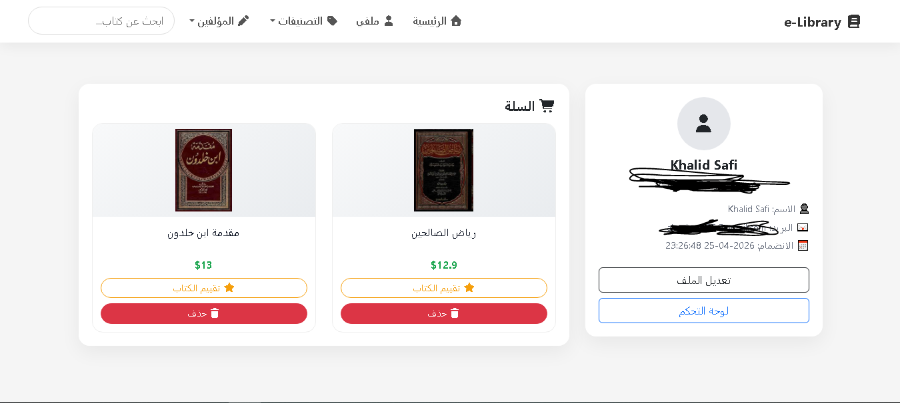
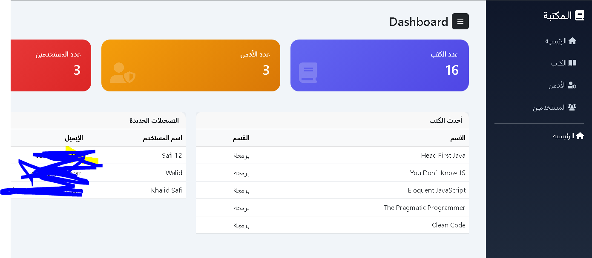

# 📚 Laravel E-Library System

A full-stack web application built with Laravel that simulates an online book store and library system.
The platform allows users to browse, search, and manage books with a complete admin dashboard.

🔗 **Live Demo:** https://e-library2.rf.gd/

---

## 🚀 Features

### 👤 User Features

* 🔍 Search for books بسهولة
* 🛒 Add books to cart / remove from cart
* ⭐ Rate books
* 📚 Browse books by categories and authors
* 🎨 Responsive UI using Bootstrap

### 🛠️ Admin Features

* ➕ Add new books
* ✏️ Edit existing books
* ❌ Delete books
* 👥 Manage users
* 🔐 Promote users to Admin
* 📊 Admin dashboard access

---

## 🧰 Technologies Used

* **Backend:** Laravel
* **Database:** MySQL
* **Frontend:** Bootstrap, HTML, CSS
* **Icons:** FontAwesome

---

## 📸 Screenshots

### 🏠 Home Page

### 👤 Profile Page

### 🛠️ Admin Panel


---

## ⚙️ Installation

1. Clone the repository:

```bash
git clone https://github.com/your-username/e-library.git
```

2. Navigate to project folder:

```bash
cd e-library
```

3. Install dependencies:

```bash
composer install
```

4. Create `.env` file:

```bash
cp .env.example .env
```

5. Configure database in `.env`

6. Generate app key:

```bash
php artisan key:generate
```

7. Run migrations:

```bash
php artisan migrate
```

8. Start server:

```bash
php artisan serve
```

---

## 🔐 Admin Access

To access admin features, user must be assigned as **Admin** from the database or admin panel.

---

## 📌 Project Purpose

This project was built as a **portfolio project** to demonstrate full-stack development skills using Laravel, including:

* Authentication & authorization
* CRUD operations
* Role-based access control
* Real-world system design

---

## 💡 Future Improvements

* ❤️ Favorites system
* 📖 Online book reader (PDF Viewer)
* 🤖 Recommendation system
* 💳 Payment integration

---

## 🤝 Contributing

Contributions are welcome!
Feel free to fork the project and submit a pull request.

---

## 📄 License

This project is open-source and available under the MIT License.

---

## 👨‍💻 Author

Developed by **Khalid Safi**
